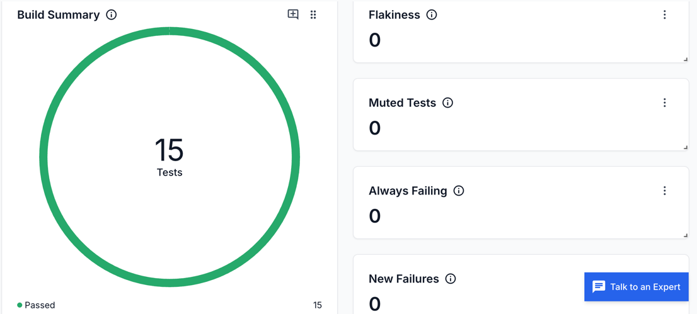
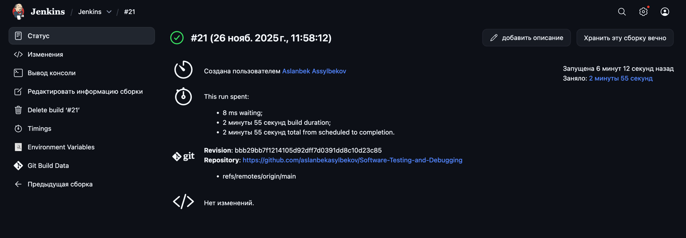
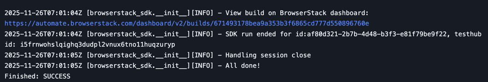

# Automated UI testing project for Demoblaze

---

## Test cases

### Page load
1. Open https://www.demoblaze.com/  
2. Click **Refresh**

### Sign Up
1. Open https://www.demoblaze.com/  
2. Click **Sign up**  
3. Enter username and password  
4. Click **Sign up** button  
5. Verify alert: “Sign up successful.”

### Log In
1. Open website  
2. Click **Log in**  
3. Enter username/password  
4. Click **Log in**  
5. Verify username appears in navbar  

### Add To Cart
1. Log in  
2. Open product page  
3. Click **Add to cart**  
4. Handle alert  
5. Verify item is added 

### Contact Form
1. Click **Contact**  
2. Fill form (email, name, message)  
3. Click **Send message**  
4. Verify alert: “Thanks for the message!!”

## BrowserStack

You can see aa report included with the test cases: `report.html`

## Jenkins
Status of Jenkins

Console

Result Browserstack in Jenkins

